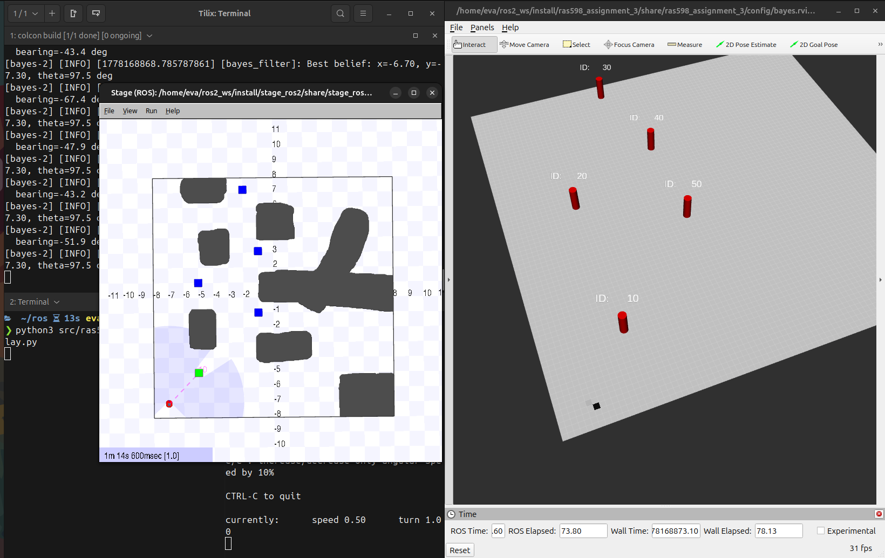
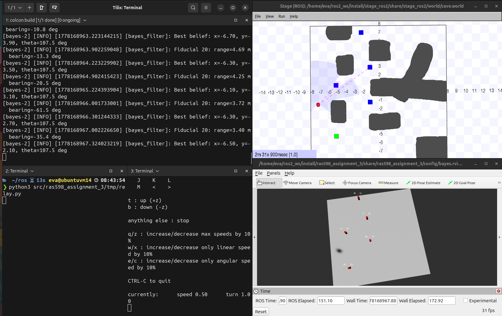
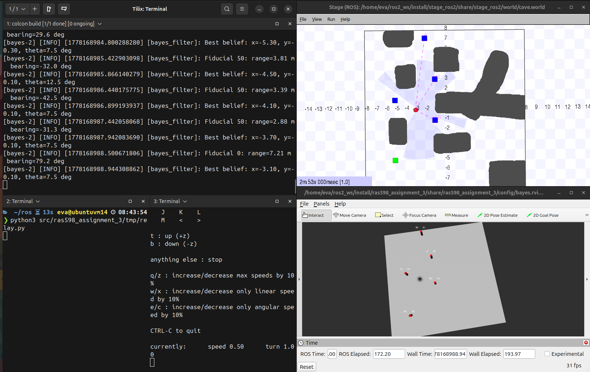
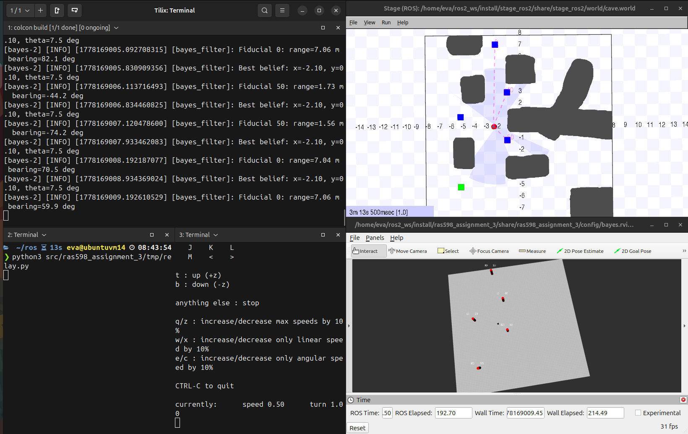

# 3D Bayes Filter Robot Localization in ROS2

A ROS2 Jazzy implementation of a **3D Discrete Bayes Filter / Histogram Filter** for mobile robot localization using noisy odometry and fiducial landmark observations in the Stage simulator.

This project was developed for **RAS 598: Mobile Robotics — Assignment 3: Robot Localization**.

---

## Overview

This repository implements probabilistic localization for a mobile robot in a known landmark-based environment. The robot does not directly know its true pose. Instead, it maintains a probability distribution, called a **belief**, over all possible robot poses:

```text
belief(x, y, theta)
```

The filter updates this belief using two sources of information:

1. **Odometry prediction** — moves and spreads the belief as the robot drives.
2. **Fiducial landmark measurements** — sharpens the belief using observed range and bearing to known landmarks.

The 3D belief distribution is visualized in RViz as a 2D costmap by marginalizing over the orientation axis.

---

## Key Features

* 3D Histogram Filter over `(x, y, theta)`
* Turn-Go-Turn odometry motion model
* Gaussian range-and-bearing landmark measurement update
* Fiducial landmark parsing from the Stage world file
* RViz visualization using `nav_msgs/OccupancyGrid`
* Landmark visualization using `visualization_msgs/MarkerArray`
* Ground truth and odometry trajectory visualization
* Modular Python implementation for ROS2 Jazzy
* Tunable motion and measurement noise parameters

---

## Algorithm Summary

### 1. State Space

The robot pose is represented as:

```text
x, y, theta
```

The belief is stored as a 3D NumPy array:

```python
belief.shape = (80, 80, 72)
```

Default configuration:

| Parameter     |     Value | Meaning                     |
| ------------- | --------: | --------------------------- |
| `WORLD_SIZE`  |    `16.0` | World size in meters        |
| `WORLD_MIN`   |    `-8.0` | Minimum world coordinate    |
| `WORLD_MAX`   |     `8.0` | Maximum world coordinate    |
| `SPATIAL_RES` |     `0.2` | Meters per grid cell        |
| `THETA_RES`   |     `5.0` | Degrees per orientation bin |
| Grid cells    | `80 x 80` | `16 / 0.2 = 80`             |
| Theta bins    |      `72` | `360 / 5 = 72`              |

---

### 2. Prediction Step

When an odometry message arrives, the relative motion is decomposed into:

```text
d_rot1, d_trans, d_rot2
```

This is the Turn-Go-Turn model:

```text
rotate → translate → rotate
```

The filter shifts the belief according to this motion and then applies Gaussian blur to model uncertainty.

Conceptually:

```text
predicted_belief = motion_model(previous_belief, odometry)
```

---

### 3. Measurement Update

When the robot observes a fiducial landmark, the sensor provides:

```text
marker_id, range, bearing
```

For every possible pose in the belief grid, the filter computes the expected range and bearing to that landmark:

```text
expected_range = distance from candidate pose to landmark
expected_bearing = relative angle from candidate heading to landmark
```

The measured and expected values are compared with Gaussian likelihoods:

```text
range_likelihood   = exp(-0.5 * (range_error / sigma_range)^2)
bearing_likelihood = exp(-0.5 * (bearing_error / sigma_bearing)^2)
```

Then Bayes rule is applied:

```text
belief = likelihood * predicted_belief
belief = normalize(belief)
```

---

### 4. Visualization

RViz cannot directly display the full 3D belief. Therefore, the belief is projected into 2D by summing over the orientation axis:

```python
belief_2d = np.sum(belief, axis=2)
```

This 2D belief is published as:

```text
viz/belief_costmap
```

---

## Repository Structure

```text
ras598_assignment_3/
├── config/
│   └── bayes.rviz
├── launch/
│   └── bayes_launch.py
├── ras598_assignment_3/
│   ├── __init__.py
│   ├── bayes.py
│   ├── config.py
│   ├── filter.py
│   ├── grid_utils.py
│   └── map_parser.py
├── resource/
│   └── ras598_assignment_3
├── tmp/
│   └── relay.py
├── LICENSE
├── package.xml
├── setup.cfg
└── setup.py
```

### File Descriptions

| File                                | Purpose                                                                                                                             |
| ----------------------------------- | ----------------------------------------------------------------------------------------------------------------------------------- |
| `ras598_assignment_3/bayes.py`      | Main ROS2 node. Subscribes to odometry, fiducials, and ground truth. Publishes belief and visualization topics.                     |
| `ras598_assignment_3/filter.py`     | Core 3D Histogram Filter implementation: initialization, prediction, measurement update, normalization, and best estimate.          |
| `ras598_assignment_3/grid_utils.py` | Coordinate conversion utilities between real-world coordinates and grid indices. Also includes angle wrapping and no-wrap shifting. |
| `ras598_assignment_3/map_parser.py` | Parses fiducial landmark IDs and positions from the Stage `.world` file.                                                            |
| `ras598_assignment_3/config.py`     | Centralized tuning parameters for grid resolution, initial pose, motion noise, measurement noise, and numerical stability.          |
| `launch/bayes_launch.py`            | Launches the Stage simulator, Bayes filter node, and RViz configuration.                                                            |
| `config/bayes.rviz`                 | RViz configuration for visualizing belief, landmarks, ground truth path, and odometry path.                                         |
| `tmp/relay.py`                      | Helper script for relaying teleoperation commands to the simulator command topic.                                                   |
| `setup.py`                          | Python package setup and ROS2 console script entry point.                                                                           |
| `package.xml`                       | ROS2 package metadata and dependencies.                                                                                             |

---

## System Environment

This project was developed and tested on:

| Component  | Version / Configuration          |
| ---------- | -------------------------------- |
| OS         | Ubuntu 24.04 LTS Desktop         |
| ROS2       | ROS2 Jazzy                       |
| Machine    | Dell Alienware x16 Aurora        |
| CPU        | Intel Core i9, multi-core 64-bit |
| RAM        | 16 GB                            |
| GPU Driver | NVIDIA Driver 580.126.09         |
| CUDA       | 13.0                             |
| Language   | Python                           |

Default ROS2 setup commands:

```bash
source /opt/ros/jazzy/setup.bash
source ~/ros2_ws/install/setup.bash
cd ~/ros2_ws
```

---

## Dependencies

### ROS2 Packages

* `rclpy`
* `nav_msgs`
* `geometry_msgs`
* `visualization_msgs`
* `std_msgs`
* `marker_msgs`
* `teleop_twist_keyboard`
* `stage_ros2`
* `rviz2`

### Python Libraries

* `numpy`
* `scipy`

### Workspace Assumption

This package assumes it is located in:

```text
~/ros2_ws/src/ras598_assignment_3
```

and that `stage_ros2` is available in the same ROS2 workspace:

```text
~/ros2_ws/src/stage_ros2
```

Install the required Stage ROS2 simulator branch with:

```bash
cd ~/ros2_ws/src
rm -rf stage_ros2
git clone -b bayes https://github.com/ras-mobile-robotics/stage_ros2.git
```

The Stage world file is expected at:

```text
~/ros2_ws/src/stage_ros2/world/cave.world
```

---

## Build Instructions

### 1. Clone the required Stage simulator branch

From the workspace source directory:

```bash
cd ~/ros2_ws/src
rm -rf stage_ros2
git clone -b bayes https://github.com/ras-mobile-robotics/stage_ros2.git
```

### 2. Build the assignment package

From the ROS2 workspace root:

```bash
cd ~/ros2_ws
source /opt/ros/jazzy/setup.bash
colcon build --symlink-install --packages-select ras598_assignment_3
source ~/ros2_ws/install/setup.bash
```

Optional full rebuild:

```bash
cd ~/ros2_ws
rm -rf build/ install/ log/
source /opt/ros/jazzy/setup.bash
colcon build --symlink-install
source ~/ros2_ws/install/setup.bash
```

---

## Run Instructions

Use three terminals.

---

### Terminal 1: Launch Stage, Bayes Filter, and RViz

```bash
source /opt/ros/jazzy/setup.bash
source ~/ros2_ws/install/setup.bash
cd ~/ros2_ws

ros2 launch ras598_assignment_3 bayes_launch.py
```

Expected result:

* Stage simulator starts with the cave world.
* The Bayes filter node starts.
* RViz opens with the configured visualization.

---

### Terminal 2: Run Relay Script

```bash
source /opt/ros/jazzy/setup.bash
source ~/ros2_ws/install/setup.bash
cd ~/ros2_ws

python3 src/ras598_assignment_3/tmp/relay.py
```

The relay script forwards teleoperation velocity commands to the simulator-compatible command topic.

---

### Terminal 3: Run Keyboard Teleoperation

```bash
source /opt/ros/jazzy/setup.bash
source ~/ros2_ws/install/setup.bash

ros2 run teleop_twist_keyboard teleop_twist_keyboard --ros-args -r cmd_vel:=cmd_vel_raw
```

Use the keyboard controls printed by `teleop_twist_keyboard` to drive the robot.

---

## ROS2 Interfaces

### Subscribed Topics

| Topic           | Message Type                  | Purpose                                                                   |
| --------------- | ----------------------------- | ------------------------------------------------------------------------- |
| `/odom`         | `nav_msgs/Odometry`           | Noisy odometry input for the prediction step.                             |
| `/fiducials`    | `marker_msgs/MarkerDetection` | Landmark observations for the measurement update.                         |
| `/ground_truth` | `nav_msgs/Odometry`           | Ground truth trajectory visualization only. Not used by the Bayes filter. |

### Published Topics

| Topic                | Message Type                     | Purpose                                         |
| -------------------- | -------------------------------- | ----------------------------------------------- |
| `viz/belief_costmap` | `nav_msgs/OccupancyGrid`         | 2D visualization of the marginalized 3D belief. |
| `viz/landmarks`      | `visualization_msgs/MarkerArray` | Landmark cylinders and text labels.             |
| `viz/gt_path`        | `nav_msgs/Path`                  | Ground truth path for visual comparison.        |
| `viz/odom_path`      | `nav_msgs/Path`                  | Odometry-only path for drift comparison.        |

Important note:

```text
/ground_truth is never used as an input to the Bayes filter.
It is only used for visualization and performance comparison.
```

---

## Tuning Guide

The main tuning parameters are located in:

```text
ras598_assignment_3/config.py
```

Tuning controls how sharp, smooth, stable, or responsive the belief distribution is.

---

### World and Grid Parameters

```python
WORLD_SIZE = 16.0
WORLD_MIN  = -8.0
WORLD_MAX  =  8.0
```

| Parameter    | What It Does                                                | How to Tune                                                                          |
| ------------ | ----------------------------------------------------------- | ------------------------------------------------------------------------------------ |
| `WORLD_SIZE` | Defines the width and height of the square world in meters. | Should match the Stage world size. Do not change unless the world dimensions change. |
| `WORLD_MIN`  | Minimum world coordinate.                                   | For a 16 m world centered at origin, keep `-8.0`.                                    |
| `WORLD_MAX`  | Maximum world coordinate.                                   | For a 16 m world centered at origin, keep `8.0`.                                     |

Changing these incorrectly will misalign the belief map with RViz and the Stage world.

---

### Spatial Resolution

```python
SPATIAL_RES = 0.2
```

| Lower Value                | Higher Value          |
| -------------------------- | --------------------- |
| More accurate localization | Faster computation    |
| Larger belief array        | Smaller belief array  |
| Higher memory use          | Lower memory use      |
| Slower prediction/update   | Less precise estimate |

Current value:

```text
16 m / 0.2 m = 80 cells per axis
```

Recommended tuning:

| Value | Effect                                                  |
| ----: | ------------------------------------------------------- |
| `0.1` | More precise but much slower and more memory intensive. |
| `0.2` | Good balance for this assignment.                       |
| `0.4` | Faster but coarse; belief peak may be inaccurate.       |


---

### Angular Resolution

```python
THETA_RES = 5.0
```

| Lower Value                    | Higher Value                  |
| ------------------------------ | ----------------------------- |
| More accurate heading estimate | Faster computation            |
| More theta slices              | Fewer theta slices            |
| Better bearing matching        | Less precise bearing matching |
| Higher memory/computation      | Lower memory/computation      |

Current value:

```text
360 degrees / 5 degrees = 72 theta bins
```

Recommended tuning:

|  Value | Effect                                          |
| -----: | ----------------------------------------------- |
|  `2.5` | More accurate heading, slower update.           |
|  `5.0` | Good balance.                                   |
| `10.0` | Faster but bearing updates become less precise. |


---

### Initial Pose

```python
INITIAL_POSE = [-7.0, -7.0, 90.0]
```

| Parameter    | Meaning                      |
| ------------ | ---------------------------- |
| First value  | Initial x position in meters |
| Second value | Initial y position in meters |
| Third value  | Initial heading in degrees   |

How to tune:

* Use a known initial pose if the robot starts from a fixed location.
* Use a uniform belief instead if testing global localization or kidnapped robot recovery.

Current behavior:

```text
The filter starts with a localized belief near (-7, -7, 90 degrees).
```

---

### Range Measurement Noise

```python
SIGMA_RANGE = 0.5
```

This controls how strictly the filter trusts landmark distance measurements.

| Smaller `SIGMA_RANGE`                    | Larger `SIGMA_RANGE`              |
| ---------------------------------------- | --------------------------------- |
| Sharper measurement update               | Softer measurement update         |
| Faster convergence if sensor is accurate | More robust to noisy measurements |
| Higher risk of belief collapse           | Slower localization               |
| Rejects poses with small range mismatch  | Allows more possible poses        |

Recommended tuning:

| Value | Effect                                             |
| ----: | -------------------------------------------------- |
| `0.2` | Very strict. Can collapse if sensor noise is high. |
| `0.5` | Balanced for moderate fiducial noise.              |
| `1.0` | More forgiving but less sharp.                     |

Symptoms and fixes:

| Symptom                                              | Likely Cause            | Fix                    |
| ---------------------------------------------------- | ----------------------- | ---------------------- |
| Belief collapses or jumps erratically                | `SIGMA_RANGE` too small | Increase `SIGMA_RANGE` |
| Belief remains too spread out after seeing landmarks | `SIGMA_RANGE` too large | Decrease `SIGMA_RANGE` |
| Landmark updates barely affect belief                | `SIGMA_RANGE` too large | Decrease gradually     |

---

### Bearing Measurement Noise

```python
SIGMA_BEARING = 15.0
```

This controls how strictly the filter trusts landmark angle measurements.

| Smaller `SIGMA_BEARING`                        | Larger `SIGMA_BEARING`       |
| ---------------------------------------------- | ---------------------------- |
| Stronger heading correction                    | More tolerant bearing update |
| Sharper orientation estimate                   | Slower heading convergence   |
| Higher risk of rejecting correct pose if noisy | Less risk of collapse        |
| More sensitive to angle wrapping/message noise | More robust to noisy bearing |

Recommended tuning:

|  Value | Effect                                             |
| -----: | -------------------------------------------------- |
|  `5.0` | Very strict. Use only if bearing is very accurate. |
| `10.0` | Sharper than default.                              |
| `15.0` | Balanced default.                                  |
| `25.0` | More forgiving but less precise.                   |

Symptoms and fixes:

| Symptom                                       | Likely Cause                                           | Fix                                         |
| --------------------------------------------- | ------------------------------------------------------ | ------------------------------------------- |
| Orientation estimate jumps or collapses       | `SIGMA_BEARING` too small                              | Increase `SIGMA_BEARING`                    |
| Belief forms rings and does not collapse well | `SIGMA_BEARING` too large                              | Decrease `SIGMA_BEARING`                    |
| Range seems correct but heading is poor       | Bearing noise too loose or theta resolution too coarse | Lower `SIGMA_BEARING` or reduce `THETA_RES` |


---

### Motion Blur in X/Y

```python
MOTION_SIGMA_XY = 0.5
```

This controls how much the belief spreads after robot motion in the x-y plane.

| Smaller `MOTION_SIGMA_XY`                      | Larger `MOTION_SIGMA_XY`           |
| ---------------------------------------------- | ---------------------------------- |
| Belief stays sharper during motion             | Belief spreads more during motion  |
| Works if odometry is reliable                  | Better if odometry is noisy        |
| Can diverge if odometry has drift              | Can become overly diffuse          |
| Faster convergence if motion model is accurate | Slower convergence but more robust |

Recommended tuning:

| Value | Effect                                           |
| ----: | ------------------------------------------------ |
| `0.2` | Very low diffusion; belief may be overconfident. |
| `0.5` | Balanced default.                                |
| `1.0` | More uncertainty; useful for noisy odometry.     |
| `2.0` | Very spread out; may slow localization.          |

Symptoms and fixes:

| Symptom                                                     | Likely Cause            | Fix                                       |
| ----------------------------------------------------------- | ----------------------- | ----------------------------------------- |
| Belief peak moves away from ground truth and cannot recover | Motion blur too small   | Increase `MOTION_SIGMA_XY`                |
| Belief becomes too wide while driving                       | Motion blur too large   | Decrease `MOTION_SIGMA_XY`                |
| Prediction cloud does not reflect odometry uncertainty      | Poor motion blur tuning | Tune gradually in steps of `0.1` to `0.2` |


---

### Motion Blur in Theta

```python
MOTION_SIGMA_THETA = 0.3
```

This controls how much the belief spreads across orientation bins after motion.

| Smaller `MOTION_SIGMA_THETA`        | Larger `MOTION_SIGMA_THETA`          |
| ----------------------------------- | ------------------------------------ |
| Heading belief stays sharper        | Heading uncertainty increases        |
| Good for accurate rotation odometry | Good for noisy turning motion        |
| Can become overconfident            | Can make bearing update less focused |

Recommended tuning:

| Value | Effect                          |
| ----: | ------------------------------- |
| `0.1` | Very low heading diffusion.     |
| `0.3` | Balanced default.               |
| `0.6` | More angular uncertainty.       |
| `1.0` | Very broad heading uncertainty. |

Symptoms and fixes:

| Symptom                                             | Likely Cause                                                 | Fix                                                |
| --------------------------------------------------- | ------------------------------------------------------------ | -------------------------------------------------- |
| Heading estimate is too rigid and wrong after turns | `MOTION_SIGMA_THETA` too small                               | Increase it                                        |
| Belief has too many possible headings               | `MOTION_SIGMA_THETA` too large                               | Decrease it                                        |
| Bearing update struggles after rotation             | Heading uncertainty too broad or theta resolution too coarse | Tune `MOTION_SIGMA_THETA` and `THETA_RES` together |


---

### Numerical Stability Epsilon

```python
EPS = 1e-12
```

This prevents division by zero and protects the filter from numerical collapse.

| Smaller `EPS`                     | Larger `EPS`                             |
| --------------------------------- | ---------------------------------------- |
| Less artificial probability added | More numerical safety                    |
| May underflow if too tiny         | Can make updates less sharp if too large |

Recommended tuning:

|   Value | Effect                                           |
| ------: | ------------------------------------------------ |
| `1e-15` | Very small; usually safe but less protective.    |
| `1e-12` | Good default.                                    |
|  `1e-9` | More protective but can slightly flatten belief. |


---

## Practical Tuning Workflow

Recommended tuning order:

1. **Keep grid parameters fixed first**

   * Use `SPATIAL_RES = 0.2`
   * Use `THETA_RES = 5.0`

2. **Tune motion prediction**

   * Drive without focusing on landmark updates.
   * Check whether the belief cloud moves in the correct direction.
   * Adjust `MOTION_SIGMA_XY` and `MOTION_SIGMA_THETA`.

3. **Tune range update**

   * Observe one landmark.
   * Check whether the belief forms a reasonable ring or partial ring.
   * Adjust `SIGMA_RANGE`.

4. **Tune bearing update**

   * Check whether the ring collapses into a smaller region.
   * Adjust `SIGMA_BEARING`.

5. **Test convergence**

   * Drive until 2–3 landmarks are observed.
   * Check whether the belief peak approaches the ground truth path.

6. **Avoid over-tuning**

   * If the belief becomes too sharp and jumps incorrectly, increase noise values.
   * If the belief never converges, decrease measurement noise or improve angular resolution.

---

## Expected Behavior

At runtime, the belief should behave as follows:

1. **Startup**

   * Belief starts near the configured initial pose.

2. **Robot motion**

   * The belief cloud shifts in the direction of motion.
   * The belief spreads slightly due to odometry uncertainty.

3. **Single landmark observation**

   * The belief may become ring-shaped or multi-modal.
   * This happens because many poses may have similar distance to the same landmark.

4. **Range + bearing update**

   * Bearing reduces the ambiguity from range-only sensing.
   * Orientation becomes important because bearing is measured relative to robot heading.

5. **Multiple landmark observations**

   * The belief should converge toward the true robot pose.

---

## Results

### Initial Belief

```markdown

```
At startup, the belief is concentrated around the initial pose near (-7, -7, 90 degrees).

---

### Prediction Spread

```markdown

```


After motion, the belief shifts according to odometry and spreads due to motion uncertainty.


---

### Landmark Update

```markdown

```


After observing a landmark, the measurement likelihood sharpens the belief around poses that explain the observed range and bearing.

---

### Convergence

```markdown

```


After observing multiple landmarks, the belief peak converges near the ground truth trajectory.


---

## Explanation of Belief Shape


A single range measurement can create a ring-shaped belief because every pose at the same distance from a landmark produces a similar range prediction. Bearing reduces this ambiguity because the landmark must also appear at the correct relative angle from the robot's heading. Since the belief is three-dimensional over x, y, and theta, different orientations can explain or reject the same landmark observation. With multiple landmark observations, the overlap of range and bearing likelihoods becomes smaller, causing the belief to collapse from a ring or multi-modal shape into a sharper peak near the true robot pose. Motion prediction spreads the belief because odometry is noisy, while measurement updates sharpen it when landmarks are visible.


---

## Troubleshooting

### Package Not Found

Rebuild and source the workspace:

```bash
cd ~/ros2_ws
source /opt/ros/jazzy/setup.bash
colcon build --symlink-install --packages-select ras598_assignment_3
source install/setup.bash
```

---

### `cave.world` Not Found

Find the world file:

```bash
find ~/ros2_ws/src/stage_ros2 -name cave.world
```

Expected location:

```text
~/ros2_ws/src/stage_ros2/world/cave.world
```

---

### Robot Does Not Move

Make sure the relay script is running:

```bash
python3 src/ras598_ment_3/tmp/relay.py
```

Then run teleoperation:

```bash
ros2 run teleop_twist_keyboard teleop_twist_keyboard --ros-args -r cmd_vel:=cmd_vel_raw
```

---

### RViz Does Not Show Belief

Check that the topic exists:

```bash
ros2 topic list | grep belief
```

Check whether messages are being published:

```bash
ros2 topic echo /viz/belief_costmap
```

---

### Fiducials Are Not Detected

Check the fiducial topic:

```bash
ros2 topic list | grep fiducials
ros2 topic info /fiducials
```

Inspect the message structure:

```bash
ros2 interface show marker_msgs/msg/MarkerDetection
```

---

### Belief Collapses or Becomes NaN

Possible causes:

* Measurement noise is too strict.
* `SIGMA_RANGE` is too small.
* `SIGMA_BEARING` is too small.
* Landmark coordinates do not match the Stage world.
* Coordinate frame conversion is incorrect.


---

## Future Improvements

Potential extensions:

* Add adaptive noise tuning.
* Add kidnapped robot recovery mode using uniform reinitialization.
* Add support for multiple map files.
* Add quantitative error plots versus ground truth.
* Add rosbag recording and replay instructions.
* Add automated tests for coordinate conversion and measurement likelihood.
* Add GIF demo of convergence in RViz.


---

## Quick Command Reference

```bash
# Clone required Stage simulator branch
cd ~/ros2_ws/src
rm -rf stage_ros2
git clone -b bayes https://github.com/ras-mobile-robotics/stage_ros2.git

# Build
cd ~/ros2_ws
source /opt/ros/jazzy/setup.bash
colcon build --symlink-install --packages-select ras598_assignment_3
source ~/ros2_ws/install/setup.bash

# Terminal 1: launch simulation, Bayes filter, and RViz
ros2 launch ras598_assignment_3 bayes_launch.py

# Terminal 2: relay teleop command topic
python3 src/ras598_assignment_3/tmp/relay.py

# Terminal 3: keyboard teleop
ros2 run teleop_twist_keyboard teleop_twist_keyboard --ros-args -r cmd_vel:=cmd_vel_raw
```
